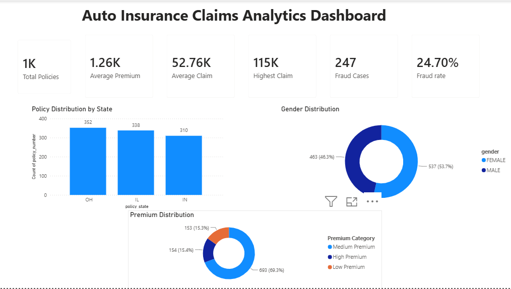
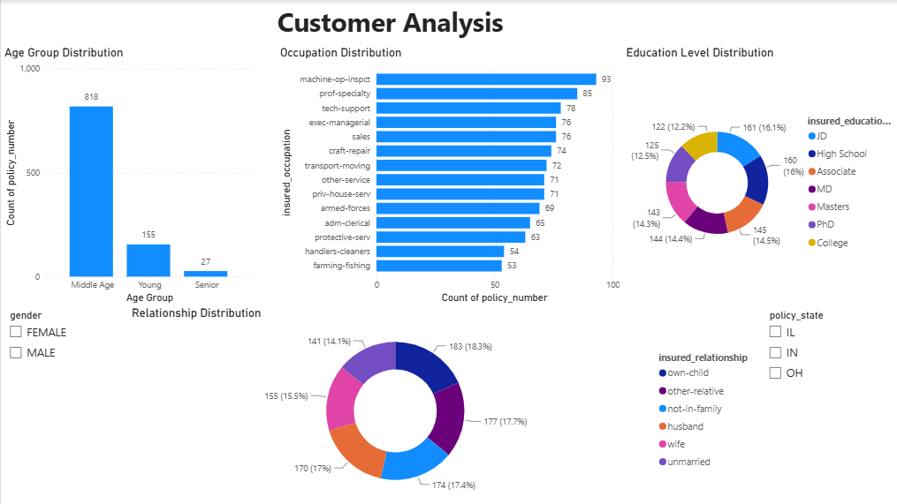
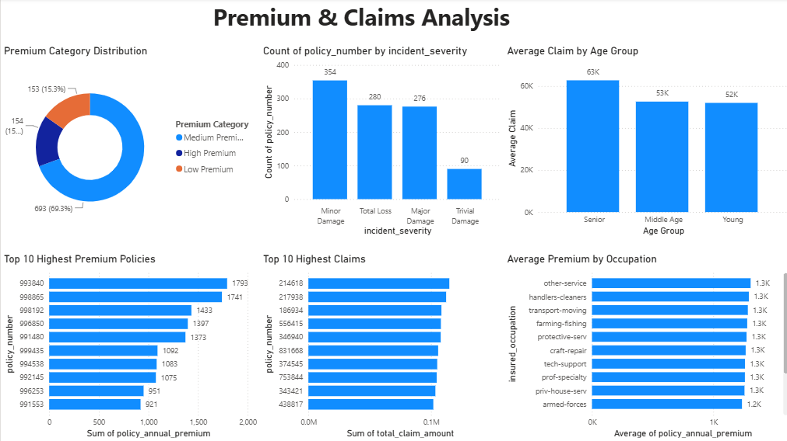
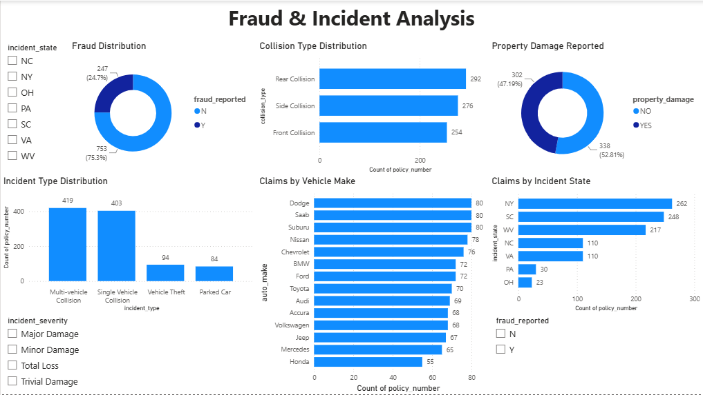

# Auto Insurance Claims Analytics Dashboard (Power BI)

## Project Overview

This Power BI project analyzes an Auto Insurance Claims dataset to uncover insights related to customer demographics, insurance premiums, claim patterns, and fraud detection.

The dashboard transforms raw insurance data into interactive visualizations, enabling users to explore customer behavior, premium distribution, claim trends, and fraud indicators through an intuitive business intelligence solution.

The project follows an end-to-end analytics workflow consisting of data cleaning, data transformation, DAX calculations, dashboard design, and interactive reporting.

---

# Dashboard Preview

## 1. Executive Overview

---

## 2. Customer Analysis

---

## 3. Premium & Claims Analysis

---

## 4. Fraud & Incident Analysis

---

# Dashboard Overview

## Dashboard 1 – Executive Overview

Provides a high-level summary of the insurance portfolio through key performance indicators and customer distribution.

### KPIs

- Total Policies
- Average Annual Premium
- Average Claim Amount
- Highest Claim Amount
- Fraud Cases
- Fraud Rate

### Visualizations

- Policy Distribution by State
- Gender Distribution
- Premium Category Distribution

---

## Dashboard 2 – Customer Analysis

Focuses on customer demographics and policyholder segmentation.

### Visualizations

- Age Group Distribution
- Occupation Distribution
- Education Level Distribution
- Relationship Status Distribution

### Interactive Filters

- Gender
- Policy State

---

## Dashboard 3 – Premium & Claims Analysis

Analyzes premium trends and claim characteristics to identify financial patterns.

### Visualizations

- Premium Category Distribution
- Top 10 Highest Premium Policies
- Claim Severity Distribution
- Average Claim by Age Group
- Top 10 Highest Claims
- Average Premium by Occupation

---

## Dashboard 4 – Fraud & Incident Analysis

Examines claim incidents and fraud-related attributes.

### Visualizations

- Fraud Distribution
- Incident Type Distribution
- Collision Type Distribution
- Claims by Vehicle Make
- Property Damage Reported
- Claims by Incident State

### Interactive Filters

- Incident State
- Incident Severity
- Fraud Reported

---

# Key Business Insights

- The dataset contains **1,000 insurance policies** with an average annual premium of approximately **₹1,256**.
- The average claim amount is approximately **₹52,762**, while the highest recorded claim exceeds **₹114,000**.
- Approximately **24.7%** of all claims were reported as fraudulent.
- **Ohio (OH)** has the highest number of policies, followed by **Illinois (IL)** and **Indiana (IN)**.
- Middle-aged customers represent the largest customer segment.
- Medium-premium policies account for nearly **70%** of all policies.
- Senior customers have the highest average claim amount among all age groups.
- Multi-vehicle and single-vehicle collisions represent the majority of reported incidents.
- Rear collisions are the most common collision type.
- Property damage is reported in nearly half of all claims.

---

# Business Recommendations

- Strengthen fraud investigation procedures for high-value claims.
- Prioritize fraud detection models for collision-related incidents.
- Develop premium pricing strategies based on customer demographics and claim behavior.
- Monitor regions with higher claim frequencies to improve risk management.
- Design targeted insurance products for dominant customer segments.
- Enhance customer segmentation for more personalized insurance offerings.

---

# DAX Measures Used

- Total Policies
- Average Premium
- Average Claim
- Highest Claim
- Fraud Cases
- Fraud Rate
- Premium Category (Calculated Column)
- Age Group (Calculated Column)

---

# Tools & Technologies

- Power BI Desktop
- Power Query
- DAX (Data Analysis Expressions)
- Microsoft Excel

---

# Files Included

- `Auto Insurance Claims Analytics.pbix` – Power BI dashboard
- `autoclaims_cleaned.csv` – Cleaned dataset
- `README.md` – Project documentation
- `Screenshots/`
  - `dashboard_1_executive_overview.png`
  - `dashboard_2_customer_analysis.png`
  - `dashboard_3_premium_claims_analysis.png`
  - `dashboard_4_fraud_incident_analysis.png`

---

# Skills Demonstrated

- Data Cleaning
- Data Transformation
- Dashboard Design
- Business Intelligence
- Data Visualization
- DAX Calculations
- KPI Development
- Customer Segmentation
- Claims Analysis
- Fraud Analysis
- Interactive Reporting
- Data Storytelling

---

# Future Enhancements

- Integrate SQL Server as a live data source.
- Build predictive models for fraud detection.
- Add drill-through pages for detailed claim analysis.
- Include time-series analysis for policy and claim trends.
- Publish the dashboard using Power BI Service.

---

# Author

**Ronik Matta**

Actuarial Science Student 
